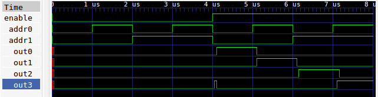
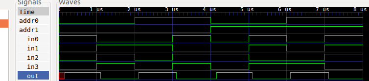
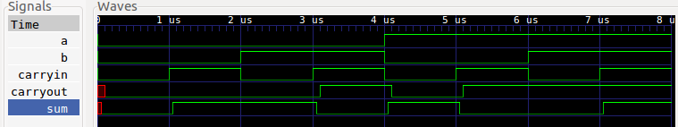

## Homework 0b010: Verilog Building Blocks
##### *William Fairman 9-22-18*

## Decoder

#### Truth Table
| EN | A0 | B0 | Out0 | Out1 | Out2 | Out3 |
| :---:  |  :---: |  :---: | :---: | :---: | :---: | :---: |
| 0 | x | x | 0 | 0 | 0 | 0 |
| 1 | 0 | 0 | 1 | 0 | 0 | 0 |
| 1 | 0 | 0 | 0 | 1 | 0 | 0 |
| 1 | 0 | 0 | 0 | 0 | 1 | 0 |
| 1 | 0 | 0 | 0 | 0 | 0 | 1 |

#### Code Representation of Logic Gates
```
//INPUTS & OUTPUTS
    output out0, out1, out2, out3,
    input address0, address1,
    input enable

//WIRES
    wire address0norAddress1;
    wire address0andAddress1;
    wire nAddress0andAddress1;
    wire address0andnAddress1;

    wire nAddress1;
    wire nAddress0;

//LOGIC GATES
    `NOT notA1(nAddress1, address1);
    `NOT notA0(nAddress0, address0);
    `NOR nor0(address0norAddress1, address0, address1);
    `AND and1(address0andnAddress1, address0, nAddress1);
    `AND and2(nAddress0andAddress1, nAddress0, address1);
    `AND and3(address0andAddress1, address0, address1);

    `AND enable0(out0, enable, address0norAddress1);
    `AND enable1(out1, enable, address0andnAddress1);
    `AND enable2(out2, enable, nAddress0andAddress1);
    `AND enable3(out3, enable, address0andAddress1);
```
#### Test Output
##### Behavioral
```
En A0 A1| O0 O1 O2 O3 | Expected Output
0  0  0 |  0  0  0  0 | All false
0  1  0 |  0  0  0  0 | All false
0  0  1 |  0  0  0  0 | All false
0  1  1 |  0  0  0  0 | All false
1  0  0 |  1  0  0  0 | O0 Only
1  1  0 |  0  1  0  0 | O1 Only
1  0  1 |  0  0  1  0 | O2 Only
1  1  1 |  0  0  0  1 | O3 Only
```
##### Structural
```
En A0 A1| O0 O1 O2 O3 | Expected Output
0  0  0 |  0  0  0  0 | All false
0  1  0 |  0  0  0  0 | All false
0  0  1 |  0  0  0  0 | All false
0  1  1 |  0  0  0  0 | All false
1  0  0 |  1  0  0  0 | O0 Only
1  1  0 |  0  1  0  0 | O1 Only
1  0  1 |  0  0  1  0 | O2 Only
1  1  1 |  0  0  0  1 | O3 Only

```
#### Signal Output
##### Structural


## Multiplexer

#### Truth Table
| A1 | A2 | In0 | In1 | In2 | In3 | Out |
| :---: |:---:| :---: |  :---: |  :---: |  :---: | :---: |
| 0 | 0 | 1 | x | x | x | 1 |
| 0 | 0 | 0 | x | x | x | 0 |
| 0 | 1 | x | 1 | x | x | 1 |
| 0 | 1 | x | 0 | x | x | 0 |
| 1 | 0 | x | x | 1 | x | 1 |
| 1 | 0 | x | x | 0 | x | 0 |
| 1 | 1 | x | x | x | 1 | 1 |
| 1 | 1 | x | x | x | 0 | 0 |

#### Code Representation of Logic Gates
```
//INPUTS & OUTPUTS
    output out,
    input address0, address1,
    input in0, in1, in2, in3

//WIRES
    wire nA0;
    wire nA1;
    wire out0;
    wire out1;
    wire out2;
    wire out3;

//LOGIC GATES
    `NOT notA0(nA0, address0);
    `NOT notA1(nA1, address1);

    `AND out3(out3, in3, address0, address1);
    `AND out2(out2, in2, nA0, address1);
    `AND out1(out1, in1, address0, nA1);
    `AND out0(out0, in0, nA0, nA1);

    `OR outAll(out, out0, out1, out2, out3);
```
#### Test Output
##### Behavioral
```
A0 A1| in0 in1 in2 in3 | output | Expected Output
0  0 |   1   0   0   0 | 1      | 1
0  0 |   0   1   1   1 | 0      | 0
0  1 |   0   1   0   0 | 1      | 1
0  1 |   1   0   1   1 | 0      | 0
1  0 |   0   0   1   0 | 1      | 1
1  0 |   1   1   0   1 | 0      | 0
1  1 |   0   0   0   1 | 1      | 1
1  1 |   1   1   1   0 | 0      | 0

```
##### Structural
```
A0 A1| in0 in1 in2 in3 | output | Expected Output
0  0 |   1   0   0   0 | 1      | 1
0  0 |   0   1   1   1 | 0      | 0
0  1 |   0   1   0   0 | 1      | 1
0  1 |   1   0   1   1 | 0      | 0
1  0 |   0   0   1   0 | 1      | 1
1  0 |   1   1   0   1 | 0      | 0
1  1 |   0   0   0   1 | 1      | 1
1  1 |   1   1   1   0 | 0      | 0


```
#### Signal Output
##### Structural



## Full Adder

#### Truth Table
| A | B | C_in | C_out | Sum |
| :---: |:---:| :---: |  :---: |  :---: |
|0|0|0|0|0|
|0|0|1|0|1|
|0|1|0|0|1|
|0|1|1|1|0|
|1|0|0|0|1|
|1|0|1|1|0|
|1|1|0|1|0|
|1|1|1|1|1|

#### Code Representation of Logic Gates
```
//INPUTS & OUTPUTS
output sum,
output carryout,
input a,
input b,
input carryin


// WIRES
wire aAndb;
wire aAndc;
wire bAndc;

// LOGIC GATES
`AND ab(aAndb, a, b);
`AND ac(aAndc, a, carryin);
`AND bc(bAndc, b, carryin);

`XOR s(sum, a, b, carryin);
`OR  co(carryout, aAndb, aAndc, bAndc);
```
#### Test Output
##### Behavioral
```
A  B  C-In | C-Out S | Expected Output
0  0  0    | 0     0 | 0   0
0  0  1    | 0     1 | 0   1
0  1  0    | 0     1 | 0   1
0  1  1    | 1     0 | 1   0
1  0  0    | 0     1 | 0   1
1  0  1    | 1     0 | 1   0
1  1  0    | 1     0 | 1   0
1  1  1    | 1     1 | 1   1


```
##### Structural
```
A  B  C-In | C-Out S | Expected Output
0  0  0    | 0     0 | 0   0
0  0  1    | 0     1 | 0   1
0  1  0    | 0     1 | 0   1
0  1  1    | 1     0 | 1   0
1  0  0    | 0     1 | 0   1
1  0  1    | 1     0 | 1   0
1  1  0    | 1     0 | 1   0
1  1  1    | 1     1 | 1   1

```
#### Signal Output
##### Structural

